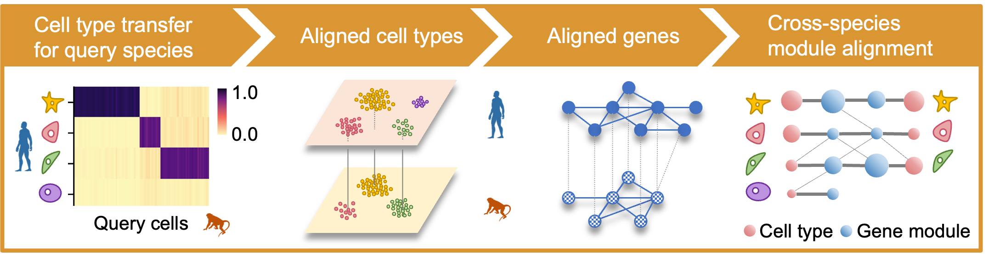

# CAME
[](https://zenodo.org/badge/latestdoi/367772907)

**English** | [简体中文](README_CH.md)

CAME is a tool for **Cell-type Assignment and Module Extraction**, based on a heterogeneous graph neural network.

For detailed usage, please refer to [CAME-Documentation](https://xingyanliu.github.io/CAME/index.html).


CAME outputs the quantitative cell-type assignment for each query cell, that is, 
the probabilities of cell types that exist in the reference species, which 
enables the identification of the unresolved cell states in the query data. 

Besides, CAME gives the aligned cell and gene embeddings across species, which 
facilitates low-dimensional visualization and joint gene-module extraction.




### Installation

It's recommended to create a conda environment for running CAME:

```shell
conda create -n env_came python=3.8
conda activate env_came
```

Install required packages:

```shell
# on CPU
pip install "scanpy[leiden]"
pip install torch  # >=1.8 
pip install dgl  # tested on 0.7.2, better below 1.0.*
```

See [Scanpy](https://scanpy.readthedocs.io/en/stable/), 
[PyTorch](https://pytorch.org/) and [DGL](https://www.dgl.ai/) 
for detailed installation guide (especially for GPU version).


Install CAME by PyPI:

```shell
pip install came
```

Install the developmental version of CAME from source code:

```shell
git clone https://github.com/XingyanLiu/CAME.git
cd CAME
python setup.py install
```

### Example data

The test code is based on the sample data attached to the CAME package. 
It is initially saved in compressed form (`CAME/came/sample_data.zip`),
and will be automatically decompressed to the default directory 
(`CAME/came/sample_data/`) when necessary, which contains the following files:

- gene_matches_1v1_human2mouse.csv (optional)
- gene_matches_1v1_mouse2human.csv (optional)
- gene_matches_human2mouse.csv
- gene_matches_mouse2human.csv
- raw-Baron_mouse.h5ad
- raw-Baron_human.h5ad 

You can access these data by ``came.load_example_data()``.

If you tend to apply CAME to analyze your own datasets, you need to
prepare at least the last two files for the same species (e.g., cross-dataset
integration);

For cross-species analysis, you need to provide another `.csv`
file where the first column contains the genes in the reference species and the
second contains the corresponding query homologous genes.


> NOTE:
> the file `raw-Baron_human.h5ad` is a subsample from the original data 
> for code testing. The resulting annotation accuracy may not be as good as 
> using the full dataset as the reference.

**Suggestions**
> 
> If you have sufficient GPU memory, setting the hidden-size `h_dim=512` 
in "came/PARAMETERS.py" may result in a more accurate cell-type transfer. 

### Test CAME's pipeline (optional)

To test the package, run the python file `test_pipeline.py`:

```python
# test_pipeline.py
import came

if __name__ == '__main__':
    came.__test1__(6, batch_size=2048)
    came.__test2__(6, batch_size=None)
```

```shell
python test_pipeline.py 
```

### Contribute

* Issue Tracker: https://github.com/XingyanLiu/CAME/issues
* Source Code:
  * https://github.com/zhanglabtools/CAME
  * https://github.com/XingyanLiu/CAME (the developmental version)

### Support

If you are having issues, please let us know. We have a mailing list located at:

* 544568643@qq.com
* xingyan@amss.ac.cn


### Citation

If CAME is useful for your research, consider citing our work:

> Liu X, Shen Q, Zhang S. Cross-species cell-type assignment of single-cell RNA-seq by a heterogeneous graph neural network[J]. Genome Research, 2022: gr. 276868.122.

> Preprint: https://doi.org/10.1101/2021.09.25.461790

