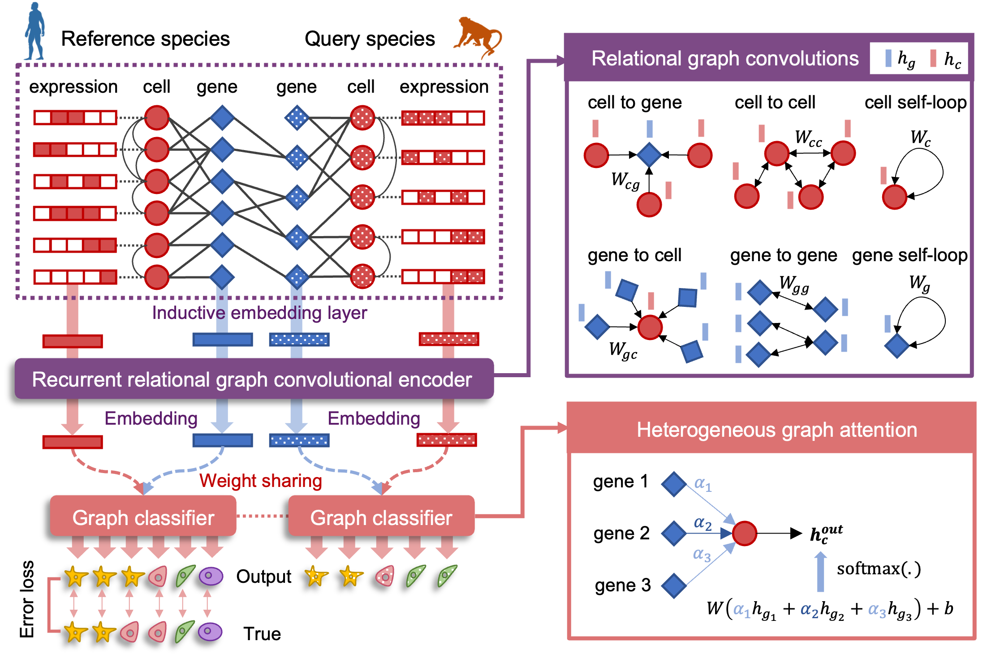

.. CAME documentation master file, created by
   sphinx-quickstart on Sat Jul 24 10:14:53 2021.
   You can adapt this file completely to your liking, but it should at least
   contain the root `toctree` directive.

CAME
====

CAME is a tool for Cell-type Assignment and Module Extraction,
based on a heterogeneous graph neural network.

To get started with CAME's pipeline, browse the tutorials below:
  * :doc:`_notebooks/getting_started_pipeline_un`
  * :doc:`_notebooks/getting_started_pipeline_aligned`

CAME outputs the quantitative cell-type assignment for each query cell, that is,
the probabilities of cell types that exist in the reference species, which
enables the identification of the unresolved cell states in the query data.
Besides, CAME gives the aligned cell and gene embeddings across species, which
facilitates low-dimensional visualization and joint gene module extraction.

.. image:: _static/Fig1D.png
   :width: 600px

.. toctree::
   :caption: Contents
   :maxdepth: 1

   installation
   tutorials
   api
   citation

Citation
--------

If CAME is useful for your research, consider citing our preprint:

   Cross-species cell-type assignment of single-cell RNA-seq by a heterogeneous graph neural network.
   Xingyan Liu, Qunlun Shen, Shihua Zhang.
   bioRxiv 2021.09.25.461790; doi: https://doi.org/10.1101/2021.09.25.461790

Contribute
----------

- Issue Tracker: https://github.com/XingyanLiu/CAME/issues
- Source Code: https://github.com/XingyanLiu/CAME

Support
-------

If you are having issues, please let us know.
We have a mailing list located at:

* xingyan@amss.ac.cn
* 544568643@qq.com

Indices and tables
==================

* :ref:`genindex`
* :ref:`search`
