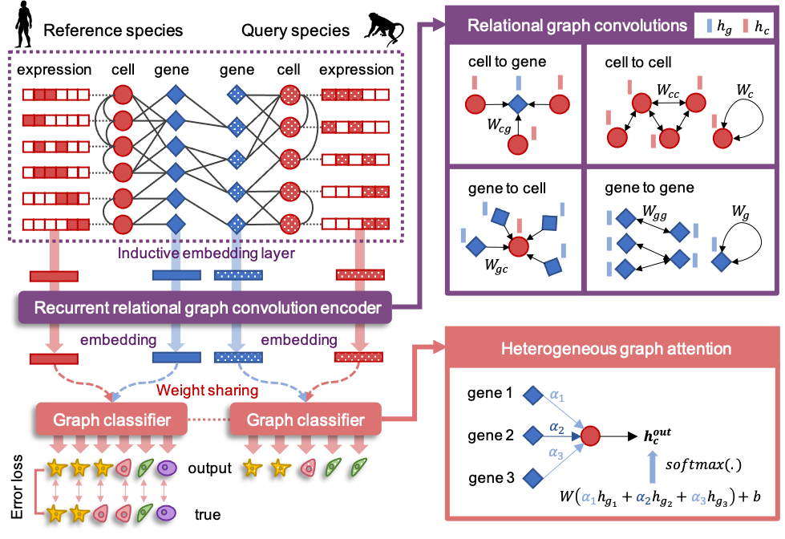

.. CAME documentation master file, created by
   sphinx-quickstart on Sat Jul 24 10:14:53 2021.
   You can adapt this file completely to your liking, but it should at least
   contain the root `toctree` directive.

Welcome to CAME's documentation!
================================

.. toctree::
   :maxdepth: 1

   installation
   tutorials
   api
   citation

Indices and tables
==================

* :ref:`genindex`
* :ref:`search`
